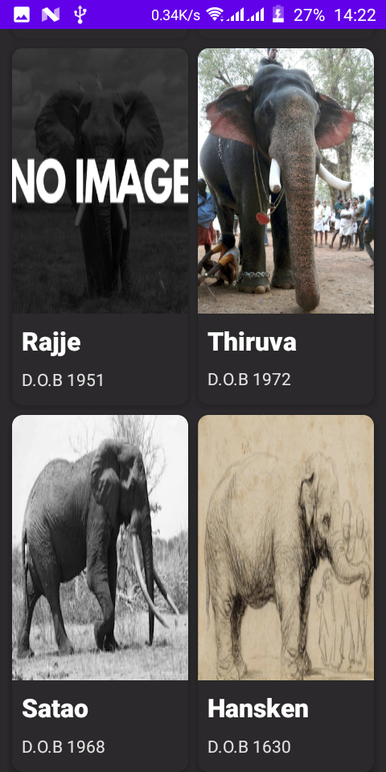

# Elephants

## Setup Requirements

- Android device or emulator
- Android Studio

## Getting Started

In order to get the app running yourself, you need to:

1.  clone this project
2.  Import the project into Android Studio
3.  Connect the android device with USB or just use your emulator
4.  In Android Studio, click on the "Run" button.

## Libraries

Libraries used in the whole application are:
- [Material Design](https://material.io/develop/android/docs/getting-started/) - build awesome beautiful UIs.🔥🔥
- Transformation layout
- Retrofit

## API Endpoint
- https://elephant-api.herokuapp.com/elephants/

## Demo

  

## Support

- Found this project useful ❤️? Support by clicking the ⭐️ button on the upper right of this page. ✌️
- Notice anything else missing? File an issue 
- Feel free to contribute in any way to the project from typos in docs to code review are all welcome.

## Get in touch - Let's be friends

Please feel free to contact me if you have any questions, ideas or even if you just want to say hi. I’m up for talking, exchange ideas, collaborations or consults. You can connect with me through any of the avenues listed below:
- [Twitter](https://twitter.com/_joelkanyi)
- [Github](https://github.com/JoelKanyi)
- [Facebook](https://www.facebook.com/joel.kanyi.71)
- [LinkedIn](https://www.linkedin.com/in/joel-kanyi-037270174/) 
